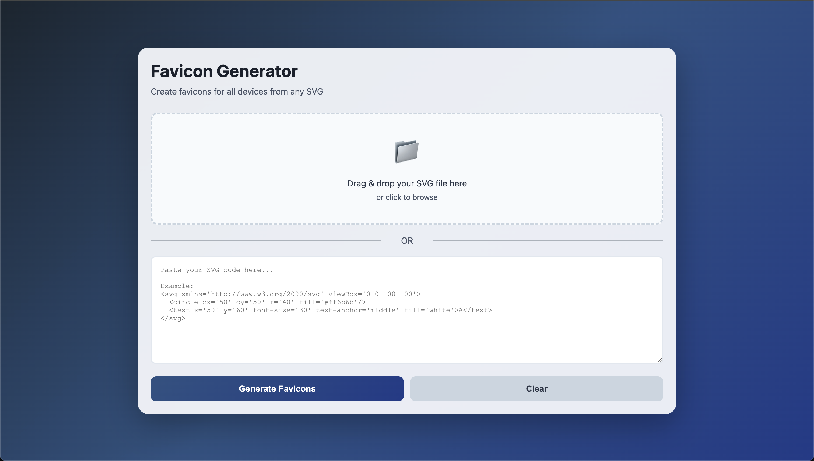

# Favicon Generator

A free online tool to generate favicons for all devices from any SVG file.

**[Live Site](https://kyoriku.github.io/favicon-generator/)** | **Tech Stack:** JavaScript, HTML5 Canvas, JSZip

**Key Features:** Drag & drop SVG upload • Real-time canvas preview • Multi-size generation (16x16 to 512x512)

<b>Built With</b>

## Technical Details

**Frontend**
- Pure vanilla JavaScript with no frameworks
- CSS Grid and Flexbox for responsive layouts
- Lucide icons for UI elements

**Core Features**
- HTML5 Canvas API for SVG to PNG conversion
- FileReader API for drag-and-drop file handling
- Blob API for image generation and downloads
- JSZip library for bulk file compression
- Clipboard API for HTML code copying

**Interactive Features**
- Drag-and-drop zone with visual feedback
- Real-time canvas preview rendering
- Error handling with user-friendly messages
- Individual file downloads or bulk ZIP export

## License

This project is licensed under the [MIT](https://opensource.org/licenses/MIT) license.

## Questions
For questions, email me at devkyoriku@gmail.com.